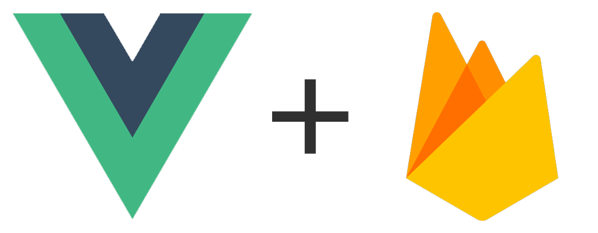

# clashclash

___

## Presentation

Clashclash est une application réalisée avec Vue.js et Firebase permettant aux joueurs d'organiser des tournois en temps réels avec toutes les personnes souhaitant participer.

Utilisant le real-time database de Firestore, l'application fournit des données en temps réel

Vous devrez vous connecter à partir de Google si vous souhaitez créer un tournoi. En revanche, un utilisateur non connecté peut rejoindre un tournoi et y participer sans problème.